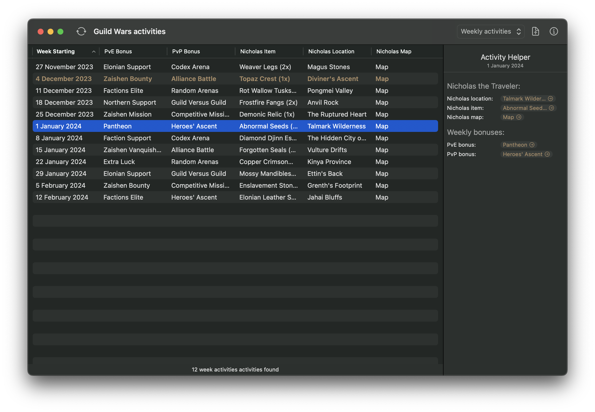
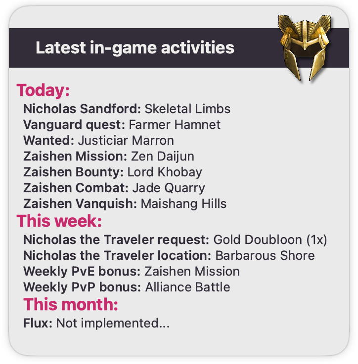

</img> 

# Guild Wars activities 
*Testing the scraping, csv formating, windgets, and the new SwiftData.*

The application aims to display on a widget the daily, weekly and monthly activities that are offered regularly and freely on the official wiki of the game.

</img> </img> </img>  

